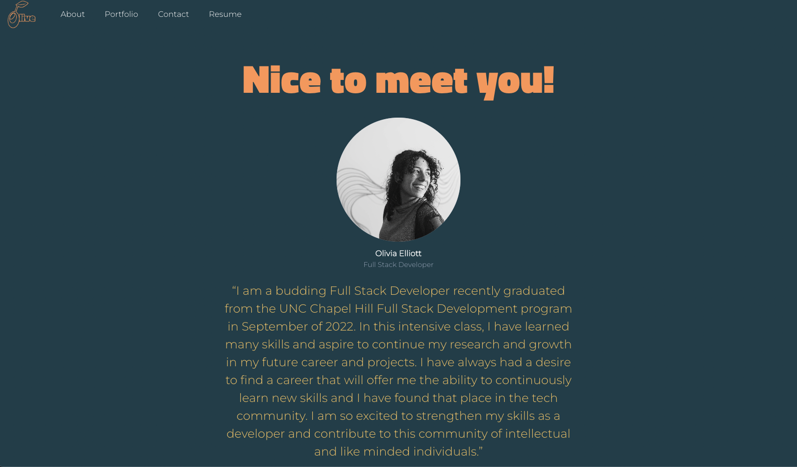
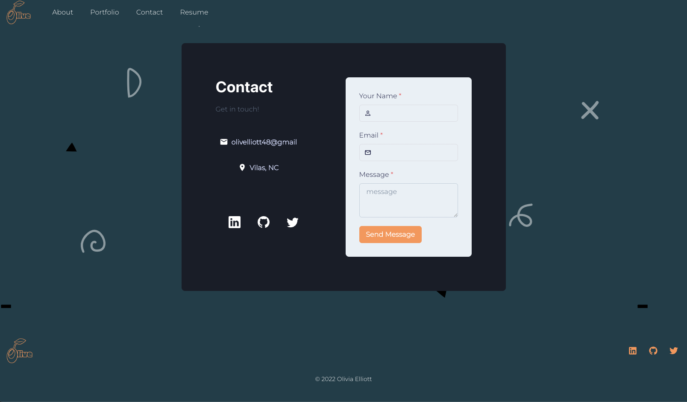
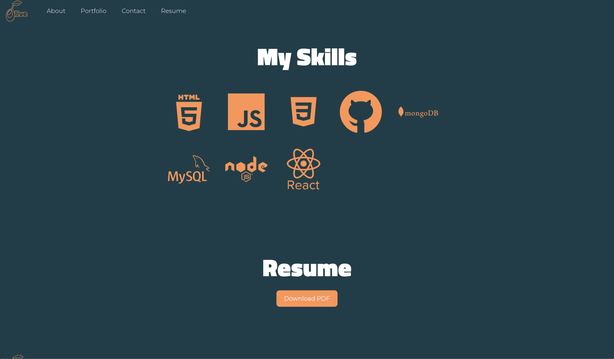

# 20 | React | React Portfolio


## Description
A portfolio created with the React library to highlight my most recent works.

## Table of Contents
- [User Story](#user-story)
- [Installation](#installation)
- [Media](#media)
- [Link](#link)
- [License](#license)
- [Contributing](#contributing)
- [Questions](#questions)
- [Credits](#credits)

## User Story
```
AS AN employer looking for candidates with experience building single-page applications
I WANT to view a potential employee's deployed React portfolio of work samples
SO THAT I can assess whether they're a good candidate for an open position
```
## Media







## Deployed Application
[Deployed Site Link](https://olivelliott.github.io/react-portfolio/)

## License
This application is licensed under the MIT license. Please click on the link below to learn more.

https://opensource.org/licenses/MIT

## Contributing

Pull requests are welcome. For major changes, please open an issue first to discuss what you would like to change.

## Questions

Please direct any questions about this project to olivelliott48@gmail.com. If you would like to see more projects, visit the GitHub link below.

https://www.github.com/olivelliott

## Credits

[Starter Code](https://github.com/coding-boot-camp/symmetrical-bassoon)